# Pangenome graph from assemblies

Built by aligning high-quality genomes, saved as paths through the pangenome.

{.half_wide_img .shadow_img}

Human Pangenome Reference Consortium (HPRC)

Liao, Asri, Ebler, et al. Nature 2023

# Pangenome

## With haplotype paths

# Snarls, intuitively
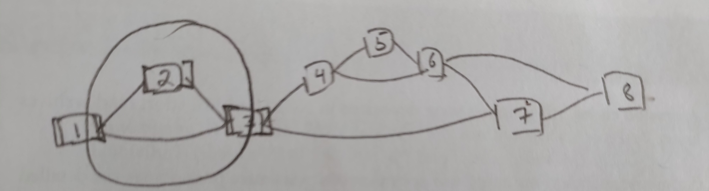

# Snarls, formal definition

A snarl is a subgraph bounded by two node sides that are: 

(1) Separable: splitting each node into its two node sides separates a subgraph from the graph

# Snarls, formal definition

A snarl is a subgraph bounded by two node sides that are: 

(1) Separable: splitting the node into its two node sides separates a subgraph from the graph

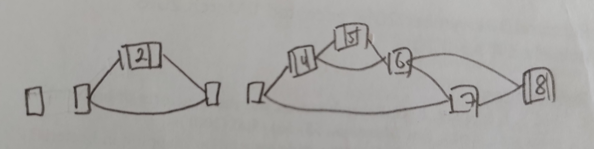

## Snarls, formal definition

A snarl is a subgraph bounded by two node sides that are: 

(1) Separable: splitting the node into its two node sides separates a subgraph from the graph

(2) Minimal: there are no nodes within the snarl that are separable with either boundary node side 

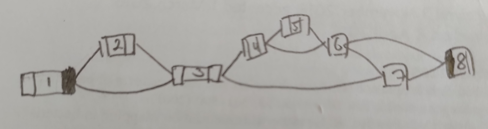

## Snarls, formal definition

A snarl is a subgraph bounded by two node sides that are: 

(1) Separable: splitting the node into its two node sides separates a subgraph from the graph

(2) Minimal: there are no nodes within the snarl that are separable with either boundary node side 

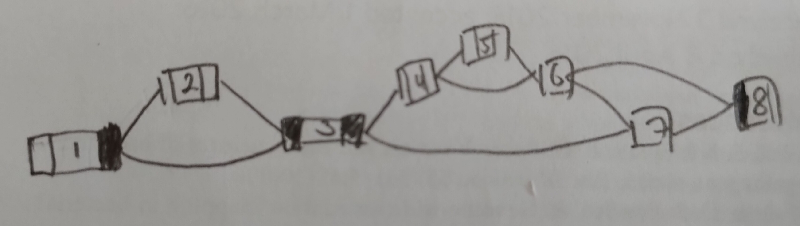

# Chains

A run of consecutive snarls and nodes is called a chain

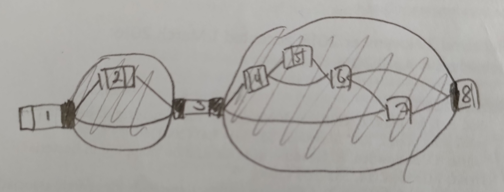

## Snarl decomposition

Snarls and chains can be nested inside of each other.

The nested relationship of snarls and chains is described by the snarl tree.

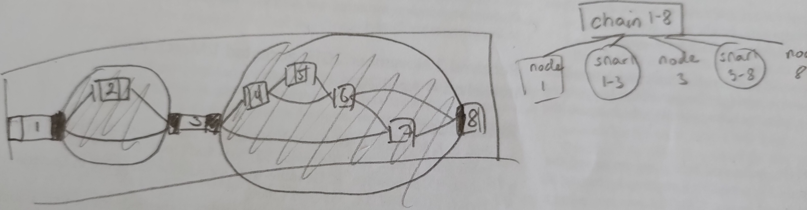

## Snarl decomposition

Snarls and chains can be nested inside of each other.

The nested relationship of snarls and chains is described by the snarl tree.

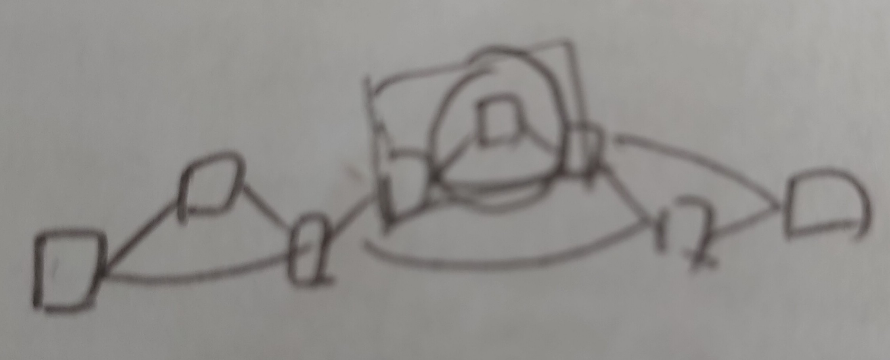

## Snarl decomposition

Snarls and chains can be nested inside of each other.

The nested relationship of snarls and chains is described by the snarl tree.

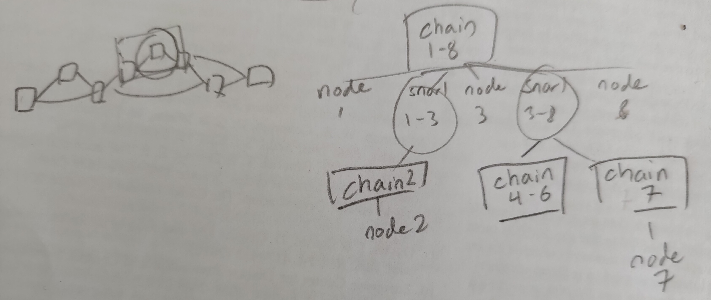

## Snarl decomposition

Snarls and chains can be nested inside of each other.

The nested relationship of snarls and chains is described by the snarl tree.

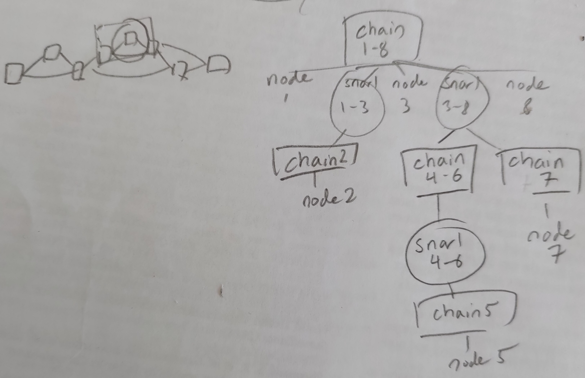

## Netgraphs

Netgraphs are a representation of snarls with their child chains collapsed into a single node

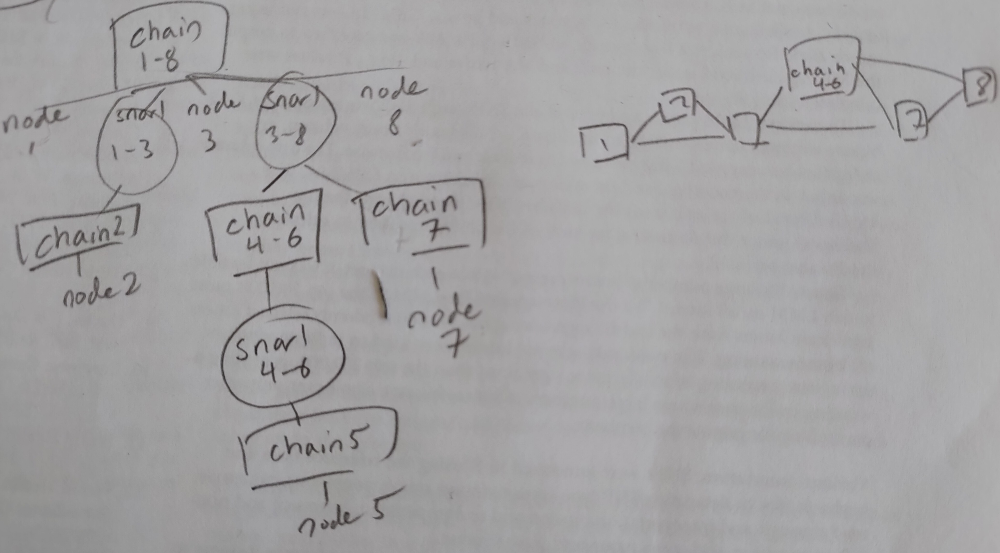

# Snarl examples (`vg deconstruct`)

vcf + graph + decomposition for this graph 

## Snarl examples (`vg deconstruct`)

vcf + graph + decomposition for this graph 

## Snarl examples (`vg deconstruct`)

vcf + graph + decomposition for this graph 

## Snarl examples (`vg deconstruct`)

Trick for getting this snarl decomposition to look better (currently only for the distance index):

`vg index -j [graph.dist] -w 6`

vcf + graph + decomposition for this graph 

# Mapping reads with `vg giraffe`

<!-- Make two columns like in https://bookdown.org/yihui/rmarkdown-cookbook/multi-column.html -->

:::: {style="display: flex;"}

::: {}
Short reads

:::

::: {}
Long reads

:::

::::

# Long read giraffe algorithm

:::: {style="display: flex;"}

::: {}

1. Seeding with **Minimizer Index**

:::

::: {}

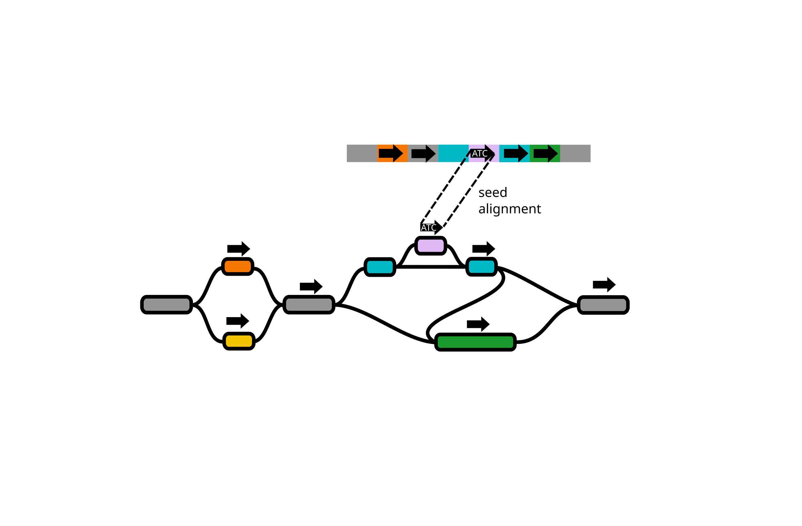

:::

::::

# Long read giraffe algorithm

:::: {style="display: flex;"}

::: {}

1. Seeding with **Minimizer Index**

2. Zip code tree making with **Distance Index**

:::

::: {}

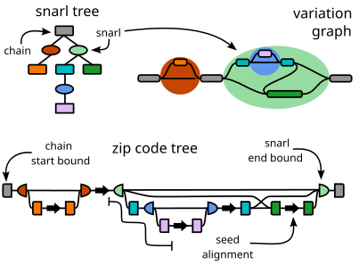

:::

::::

## Long read giraffe algorithm

:::: {style="display: flex;"}

::: {}

1. Seeding with **Minimizer Index**

2. Zip code tree making with **Distance Index**

3. Chaining with **Zip Code Trees**

:::

::: {}

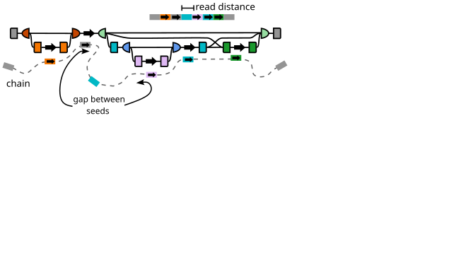

:::

::::

## Long read giraffe algorithm

:::: {style="display: flex;"}

::: {}

1. Seeding with **Minimizer Index**

2. Zip code tree making with **Distance Index**

3. Chaining with **Zip Code Trees**

4. Alignment with **GBWT/graph**

:::

::: {}

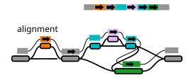

:::

::::

# Giraffe results

On the HPRC v2 graph which is x size?

# `vg` graph formats and indexes

**Indexes** 

::: incremental

1. `.gbwt` (Graph Burrows Wheeler Transform): haplotype paths
1. `.gg` (GBWT Graph): node sequences for a GBWT
1. `.dist` (Distance Index): snarl decomposition plus minimum distances
1. `.zipcodes`: per-node distance information used by `vg giraffe`
1. `.min` (Minimizer Index): minimizers used by `vg giraffe`
1. `.gcsa` (Generalized Compressed Suffix Array): substring index used by `vg map` and `vg mpmap`

:::

**Graphs** 

::: incremental

1. `.gbz` (GBWT + GG): the graph induced by the GBWT
1. `.hg` (/`.vg`) (HashGraph): graph format optimized for speed
1. `.pg` (/`.vg`) (PackedGraph): graph format optimized for space efficiency
1. `.xg`: older graph format
1. `.vg`: protobuf-based graph format 

:::

# Conclusion

# Useful resources

- vg wiki 
  - file types: https://github.com/vgteam/vg/wiki/File-Types
  -  snarl explainer: https://github.com/vgteam/vg/wiki/Snarls-and-chains
  - deconstruct: https://github.com/vgteam/vg/wiki/VCF-export-with-vg-deconstruct

- vg manpage: https://github.com/vgteam/vg/wiki/vg-manpage

- snarls paper doi: 10.1089/cmb.2017.0251

- short read giraffe paper doi: 10.1126/science.abg8871

- long read giraffe paper doi: 10.1101/2025.09.29.678807 

