# Pangenome

as a **birected** graph

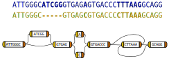

## Pangenome

as a birected graph with **haplotype paths**

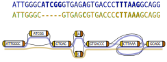

# Snarls, intuitively a "bubble"

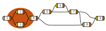

# Snarls, formal definition

A snarl is a **subgraph** bounded by two **node sides** that are: 

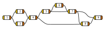

# Snarls, formal definition

A snarl is a **subgraph** bounded by two **node sides** that are: 

1. **Separable**: splitting the boundary nodes separates the snarl from the graph

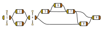

## Snarls, formal definition

A snarl is a **subgraph** bounded by two **node sides** that are: 

1. **Separable**: splitting the boundary nodes separates the snarl from the graph
2. **Minimal**: no nodes within the snarl are separable with either boundary node side 

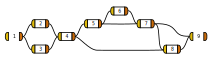

## Snarls, formal definition

A snarl is a **subgraph** bounded by two **node sides** that are: 

1. **Separable**: splitting the boundary nodes separates the snarl from the graph
2. **Minimal**: no nodes within the snarl are separable with either boundary node side 


# Chains

A run of consecutive snarls and nodes is called a **chain**.

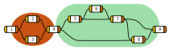

# Snarl decomposition

Snarls and chains can be **nested** inside of each other.

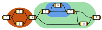

# Snarls, chains, and nodes in a tree 

The nested relationship of snarls and chains is described by the **snarl tree**.

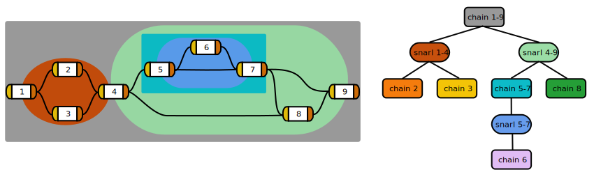

# Netgraphs

Netgraphs are a representation of snarls with their **child chains collapsed** into a single node

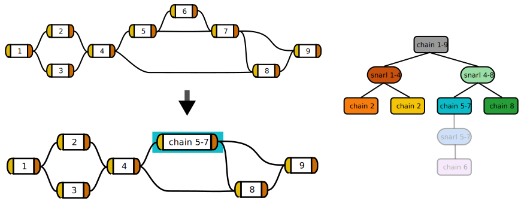


# *Deconstruct*-ing a pangenome

Enumerate **alleles for each snarl** on **a reference path**. Before: all paths.


## *Deconstruct*-ing a pangenome

Enumerate **alleles for each snarl** on **a reference path**. Now: only haplotypes.

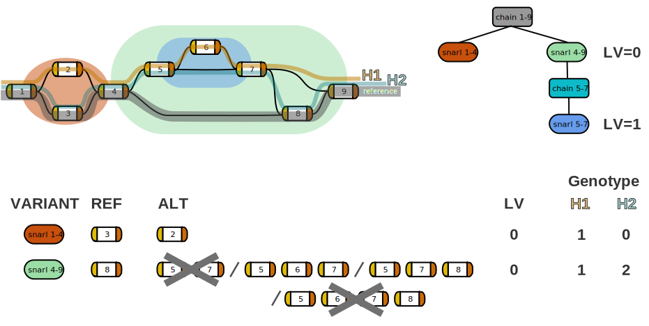

## *Deconstruct*-ing a pangenome

Enumerate **alleles for each snarl** on **a reference path** inc. nested snarls.

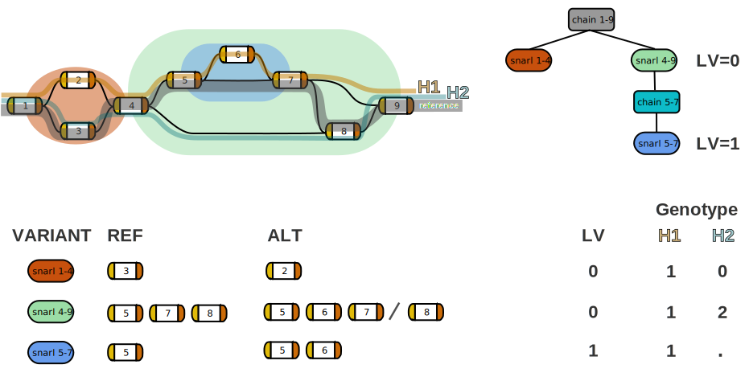

# Snarl examples (`vg deconstruct`)

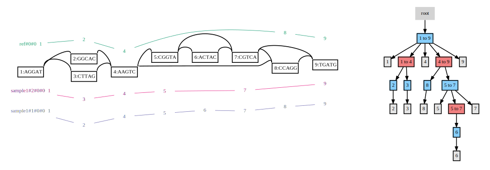

```{.smcode}
##INFO=<ID=LV,Number=1,Type=Integer,Description="Level in the snarl tree (0=top level)">
##INFO=<ID=AT,Number=R,Type=String,Description="Allele Traversal as path in graph">
#CHROM	POS	ID	REF	ALT	QUAL	FILTER	INFO	FORMAT	sample1
ref	6	>1>4	GGCAC	CTTAG	60	.	AT=>1>2>4,>1>3>4;LV=0	GT	0|1
ref	15	>4>9	CCCAGG	CCGGTAACTACCGTCACCAGG,CCGGTACGTCA	60	.	AT=>4>8>9,>4>5>6>7>8>9,>4>5>7>9;LV=0	GT	1|2
```

# Snarl examples (`vg deconstruct`)

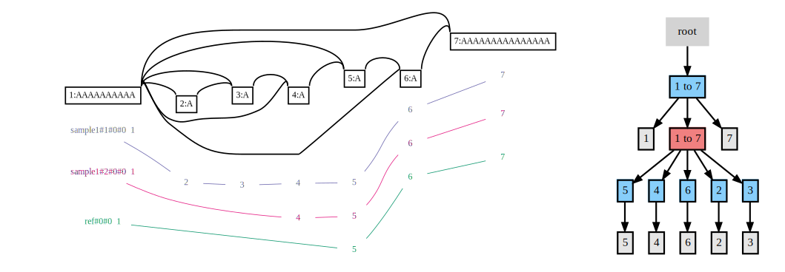

```{.smcode}
##INFO=<ID=LV,Number=1,Type=Integer,Description="Level in the snarl tree (0=top level)">
##INFO=<ID=AT,Number=R,Type=String,Description="Allele Traversal as path in graph">
#CHROM	POS	ID	REF	ALT	QUAL	FILTER	INFO	FORMAT	sample1
ref	10	>1>7	AAA	AAAAAA,AAAA	60	.	AT=>1>5>6>7,>1>2>3>4>5>6>7,>1>4>5>6>7;LV=0	GT	1|2
```

## Snarl examples (`vg deconstruct`)

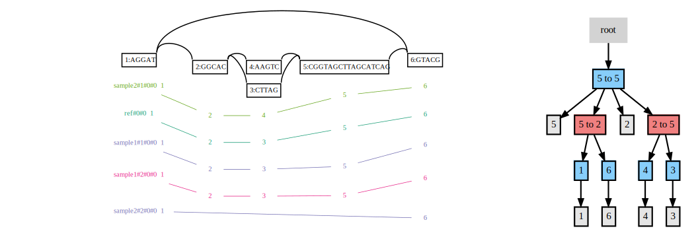

```{.smcode}
##INFO=<ID=LV,Number=1,Type=Integer,Description="Level in the snarl tree (0=top level)">
##INFO=<ID=AT,Number=R,Type=String,Description="Allele Traversal as path in graph">
#CHROM	POS	ID	REF	ALT	QUAL	FILTER	INFO	FORMAT	sample1	sample2
ref	11	>2>5	CTTAG	AAGTC	60	.	AT=>2>3>5,>2>4>5;LV=0	GT	0|0	1|.
```

## Snarl examples (`vg deconstruct -a`)

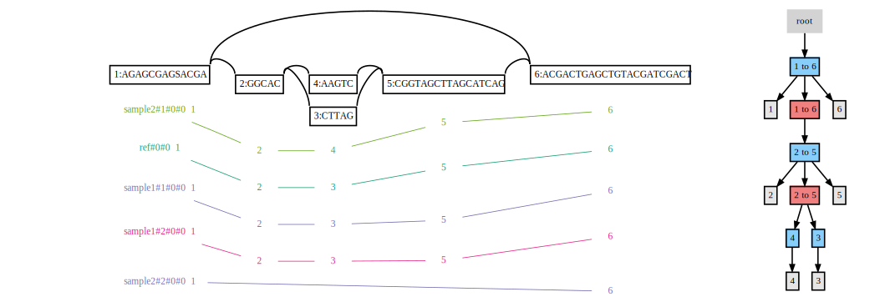

```{.smcode}
##INFO=<ID=LV,Number=1,Type=Integer,Description="Level in the snarl tree (0=top level)">
##INFO=<ID=PS,Number=1,Type=String,Description="ID of variant corresponding to parent snarl">
##INFO=<ID=AT,Number=R,Type=String,Description="Allele Traversal as path in graph">
#CHROM	POS	ID	REF	ALT	QUAL	FILTER	INFO	FORMAT	sample1	sample2
ref	13	>1>6	AGGCACCTTAGCGGTAGCTTAGCATCAG	AGGCACAAGTCCGGTAGCTTAGCATCAG,A	60	.	AT=>1>2>3>5>6,>1>2>4>5>6,>1>6;LV=0	GT	0|0	1|2
ref	19	>2>5	CTTAG	AAGTC	60	.	AT=>2>3>5,>2>4>5;LV=1;PS=>1>6	GT	0|0	1|.
```

## Snarl examples

Trick for getting this snarl decomposition to look better (currently only for the distance index):

`vg index -j [graph.dist] -w 6`

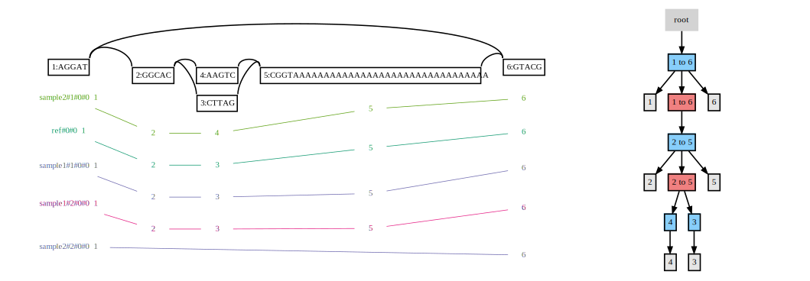


# Mapping reads with `vg giraffe`


<!-- Make two columns like in https://bookdown.org/yihui/rmarkdown-cookbook/multi-column.html -->


:::: {style="display: grid; align-items: start; justify-items: start; grid-template-columns: 1fr 1fr; grid-column-gap: 10px;"}

::: {}
<p align="left"> Short reads</p>

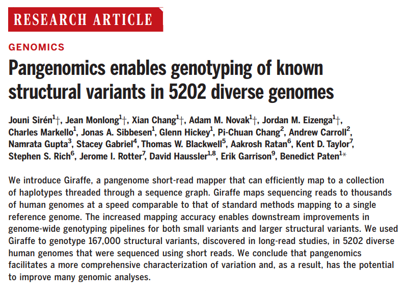
:::

::: {}
<p align="left"> Long reads</p>

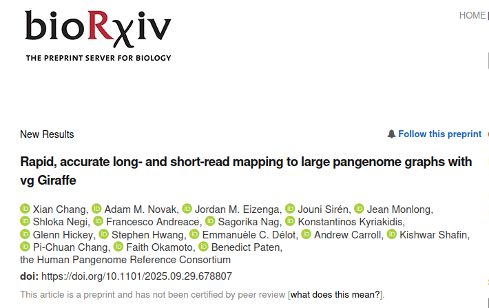
:::

::::

# Read mapping algorithm overview

:::: {style="display: grid; align-items: start; justify-items: start; grid-template-columns: 1fr 3fr; grid-column-gap: 10px;"}

::: {}

Input: Sequencing read and reference sequence

:::

::: {}


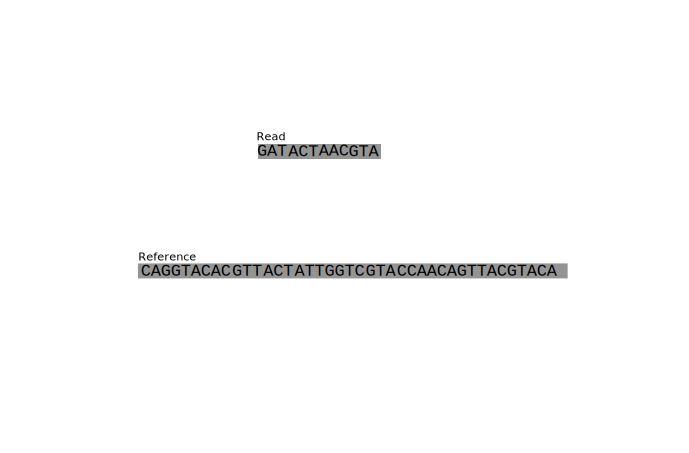

:::

::::

## Read mapping algorithm overview

:::: {style="display: grid; align-items: start; justify-items: start; grid-template-columns: 1fr 3fr; grid-column-gap: 10px;"}

::: {}


Input: Sequencing read and reference sequence

Output: Placement of the read on the reference and, usually, the edits between the sequences

:::

::: {}


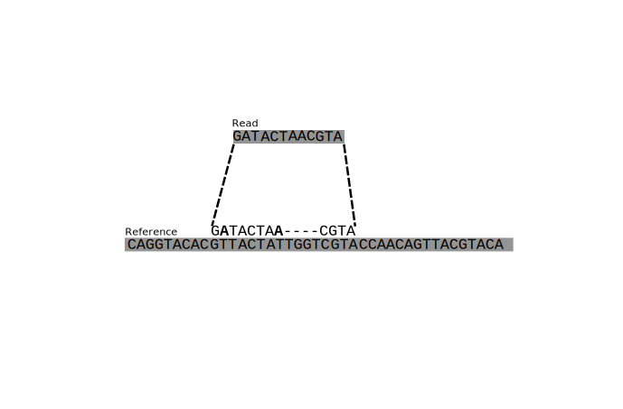

:::

::::
## Read mapping algorithm overview

:::: {style="display: grid; align-items: start; justify-items: start; grid-template-columns: 1fr 3fr; grid-column-gap: 10px;"}

::: {}

1. Seeding

:::

::: {}


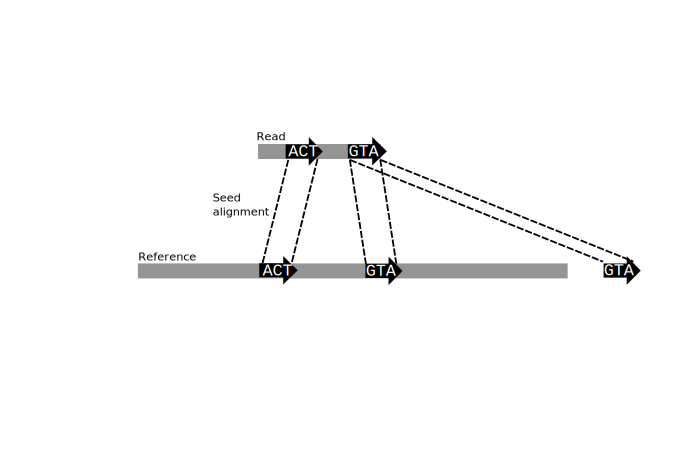

:::

::::

## Read mapping algorithm overview

:::: {style="display: grid; align-items: start; justify-items: start; grid-template-columns: 1fr 3fr; grid-column-gap: 10px;"}

::: {}

1. Seeding
1. Clustering/chaining

:::

::: {}


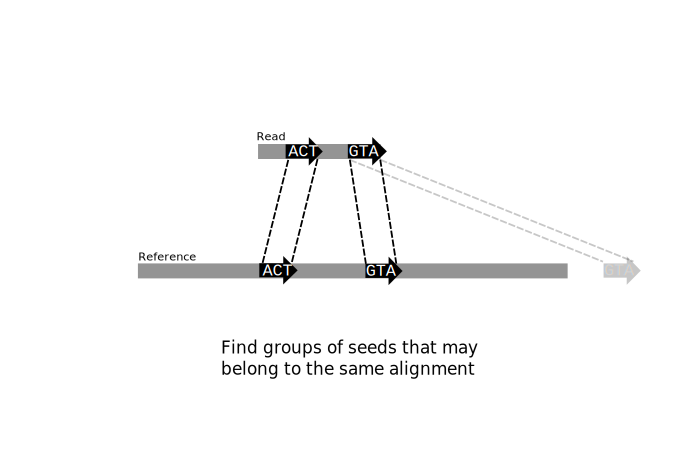

:::

::::

## Read mapping algorithm overview

:::: {style="display: grid; align-items: start; justify-items: start; grid-template-columns: 1fr 3fr; grid-column-gap: 10px;"}

::: {}

1. Seeding
1. Clustering/chaining

:::

::: {}


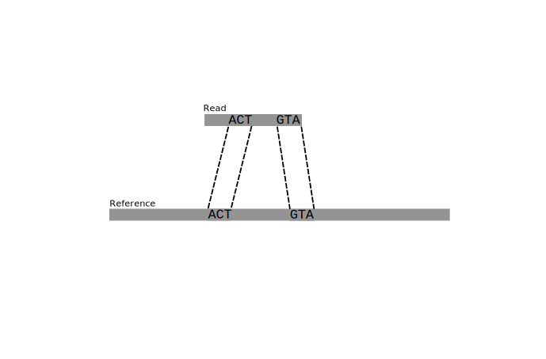

:::

::::

## Read mapping algorithm overview

:::: {style="display: grid; align-items: start; justify-items: start; grid-template-columns: 1fr 3fr; grid-column-gap: 10px;"}

::: {}

1. Seeding
1. Clustering/chaining
1. Alignment

:::

::: {}


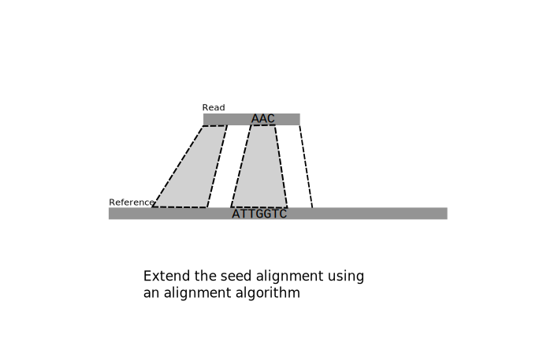

:::

::::


## Read mapping algorithm overview

:::: {style="display: grid; align-items: start; justify-items: start; grid-template-columns: 1fr 3fr; grid-column-gap: 10px;"}

::: {}

1. Seeding
1. Clustering/chaining
1. Alignment

:::

::: {}


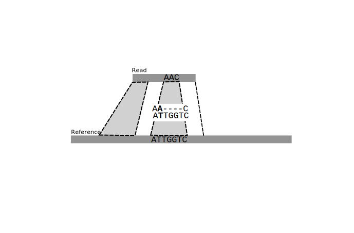

:::

::::


## Read mapping algorithm overview

:::: {style="display: grid; align-items: start; justify-items: start; grid-template-columns: 1fr 3fr; grid-column-gap: 10px;"}

::: {}

1. Seeding
1. Clustering/chaining
1. Alignment

:::

::: {}


:::

::::

## Short read giraffe algorithm

:::: {style="display: grid; align-items: start; justify-items: start; grid-template-columns: 1fr 3fr; grid-column-gap: 10px;"}

::: {}

1. Seeding
1. Clustering/chaining
1. Alignment

:::

::: {}


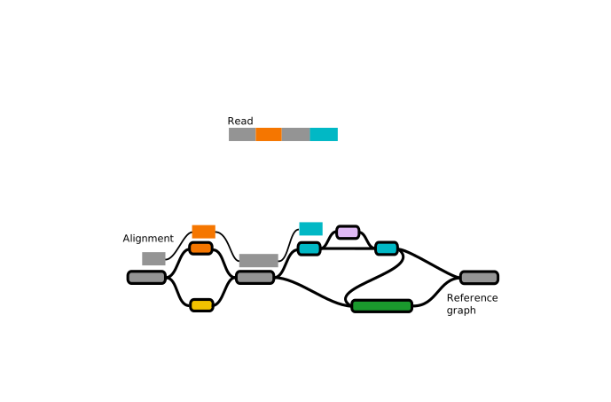

:::

::::

## Short read giraffe algorithm

:::: {style="display: grid; align-items: start; justify-items: start; grid-template-columns: 1fr 3fr; grid-column-gap: 10px;"}

::: {}

1. **Seeding** with **Minimizer Index**
1. Clustering/chaining
1. Alignment

:::

::: {}


:::

::::


## Short read giraffe algorithm

:::: {style="display: grid; align-items: start; justify-items: start; grid-template-columns: 1fr 3fr; grid-column-gap: 10px;"}

::: {}

1. Seeding
1. **Clustering** with **Distance Index**
1. Alignment

:::

::: {}


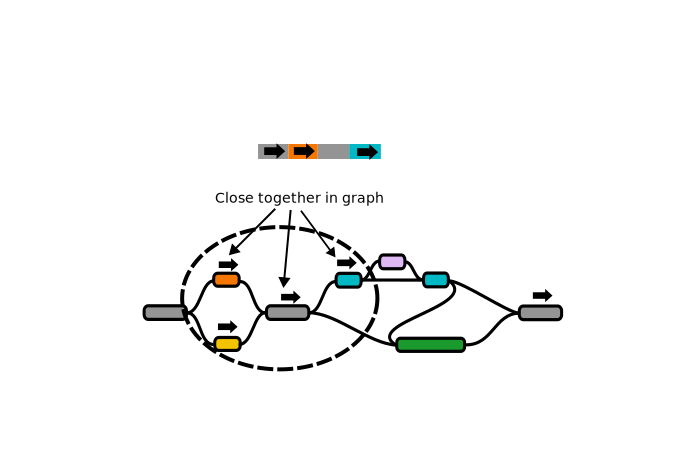

:::

::::


## Short read giraffe algorithm

:::: {style="display: grid; align-items: start; justify-items: start; grid-template-columns: 1fr 3fr; grid-column-gap: 10px;"}

::: {}

1. Seeding
1. **Clustering** with **Distance Index**
1. Alignment

:::

::: {}


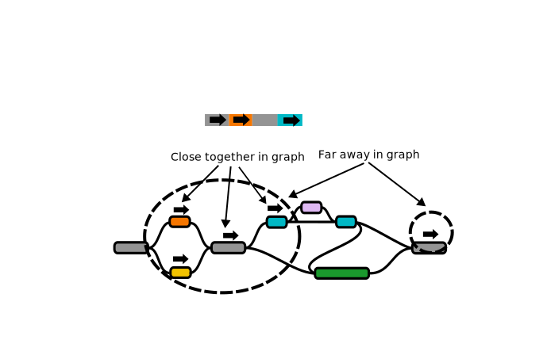

:::

::::


## Short read giraffe algorithm

:::: {style="display: grid; align-items: start; justify-items: start; grid-template-columns: 1fr 3fr; grid-column-gap: 10px;"}

::: {}

1. Seeding
1. Clustering
1. **Alignment**

:::

::: {}


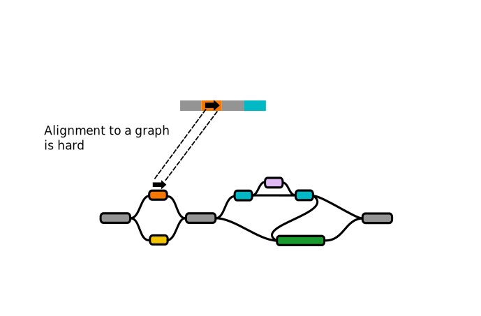

:::

::::


## Short read giraffe algorithm

:::: {style="display: grid; align-items: start; justify-items: start; grid-template-columns: 1fr 3fr; grid-column-gap: 10px;"}

::: {}

1. Seeding
1. Clustering
1. **Gapless extension**

:::

::: {}


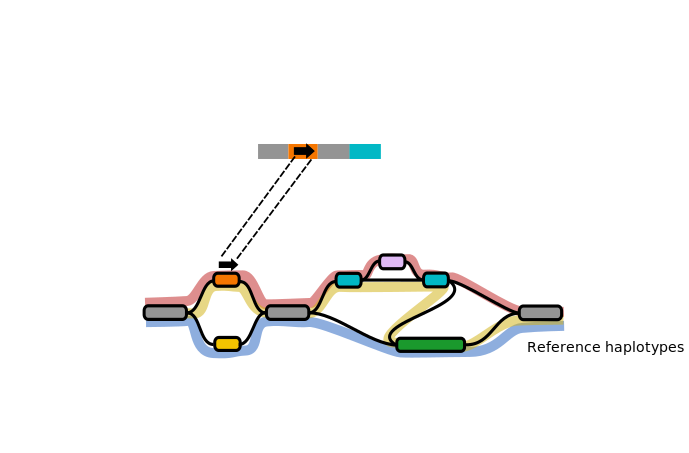

:::

::::


## Short read giraffe algorithm

:::: {style="display: grid; align-items: start; justify-items: start; grid-template-columns: 1fr 3fr; grid-column-gap: 10px;"}

::: {}

1. Seeding
1. Clustering
1. **Gapless extension** with **GBWT**

:::

::: {}


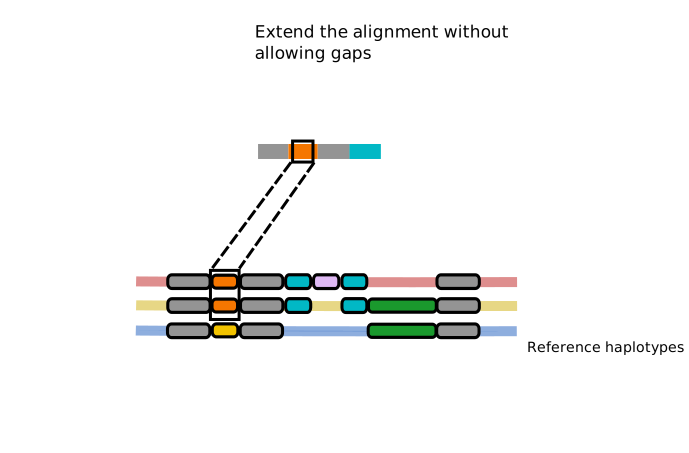

:::

::::

## Short read giraffe algorithm

:::: {style="display: grid; align-items: start; justify-items: start; grid-template-columns: 1fr 3fr; grid-column-gap: 10px;"}

::: {}

1. Seeding
1. Clustering
1. **Gapless extension** with **GBWT**

:::

::: {}


:::

::::

## Short read giraffe algorithm

:::: {style="display: grid; align-items: start; justify-items: start; grid-template-columns: 1fr 3fr; grid-column-gap: 10px;"}

::: {}

1. Seeding
1. Clustering
1. **Gapless extension** with **GBWT**

:::

::: {}


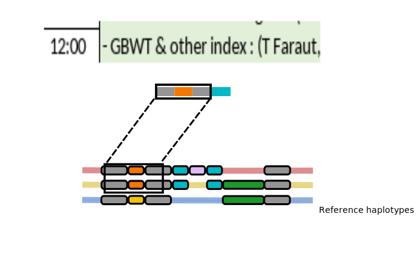

:::

::::


## Short read giraffe algorithm

:::: {style="display: grid; align-items: start; justify-items: start; grid-template-columns: 1fr 3fr; grid-column-gap: 10px;"}

::: {}

1. Seeding
1. Clustering
1. Gapless extension
1. **Gapped alignment** with graph

:::

::: {}


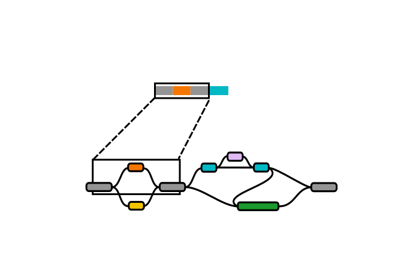

:::

::::


## Short read giraffe algorithm

:::: {style="display: grid; align-items: start; justify-items: start; grid-template-columns: 1fr 3fr; grid-column-gap: 10px;"}

::: {}

1. Seeding
1. Clustering
1. Gapless extension
1. **Gapped alignment** with graph

:::

::: {}


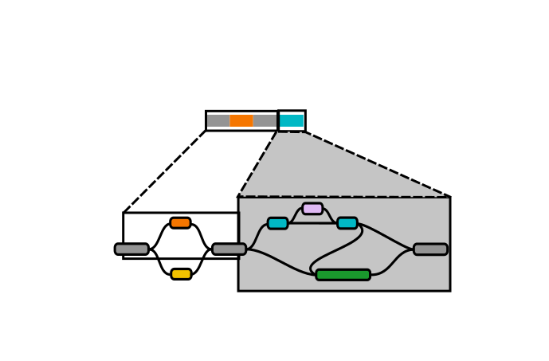

:::

::::


## Short read giraffe algorithm

:::: {style="display: grid; align-items: start; justify-items: start; grid-template-columns: 1fr 3fr; grid-column-gap: 10px;"}

::: {}

1. Seeding
1. Clustering
1. Gapless extension
1. **Gapped alignment** with graph

:::

::: {}


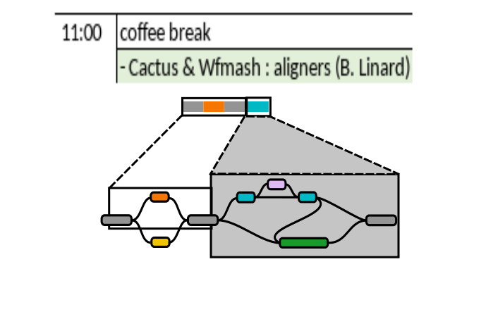

:::

::::

## Short read giraffe algorithm

:::: {style="display: grid; align-items: start; justify-items: start; grid-template-columns: 1fr 3fr; grid-column-gap: 10px;"}

::: {}

1. Seeding
1. Clustering
1. Gapless extension
1. Gapped alignment

:::

::: {}


:::

::::


# Long read giraffe algorithm

:::: {style="display: grid; align-items: start; justify-items: start; grid-template-columns: 1fr 3fr; grid-column-gap: 10px;"}

::: {}

1. Seeding
1. Clustering/chaining
1. Alignment

:::

::: {}


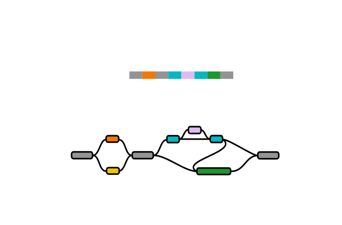

:::

::::


# Long read giraffe algorithm

:::: {style="display: grid; align-items: start; justify-items: start; grid-template-columns: 1fr 3fr; grid-column-gap: 10px;"}

::: {}

1. **Seeding** with **Minimizer Index**
1. Clustering/chaining
1. Alignment

:::

::: {}


:::

::::


# Long read giraffe algorithm

:::: {style="display: grid; align-items: start; justify-items: start; grid-template-columns: 1fr 3fr; grid-column-gap: 10px;"}

::: {}

1. Seeding 
1. **Chaining**
1. Alignment


:::

::: {}

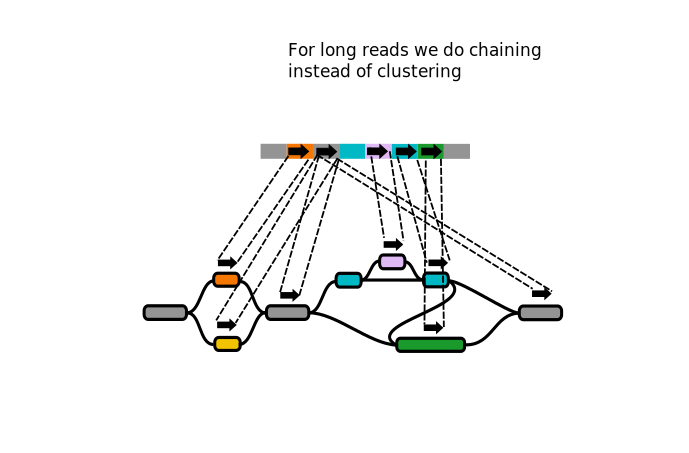

:::

::::


## Long read giraffe algorithm

:::: {style="display: grid; align-items: start; justify-items: start; grid-template-columns: 1fr 3fr; grid-column-gap: 10px;"}

::: {}

1. Seeding 
1. **Chaining**
1. Alignment


:::

::: {}

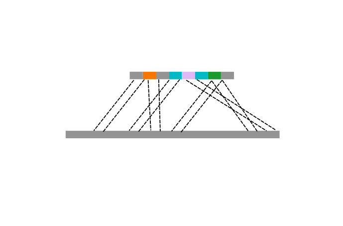

:::

::::

## Long read giraffe algorithm

:::: {style="display: grid; align-items: start; justify-items: start; grid-template-columns: 1fr 3fr; grid-column-gap: 10px;"}

::: {}

1. Seeding 
1. **Chaining**
1. Alignment


:::

::: {}

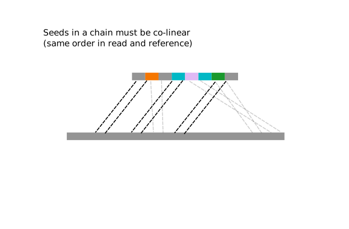

:::

::::

## Long read giraffe algorithm

:::: {style="display: grid; align-items: start; justify-items: start; grid-template-columns: 1fr 3fr; grid-column-gap: 10px;"}

::: {}

1. Seeding 
1. **Chaining**
1. Alignment


:::

::: {}

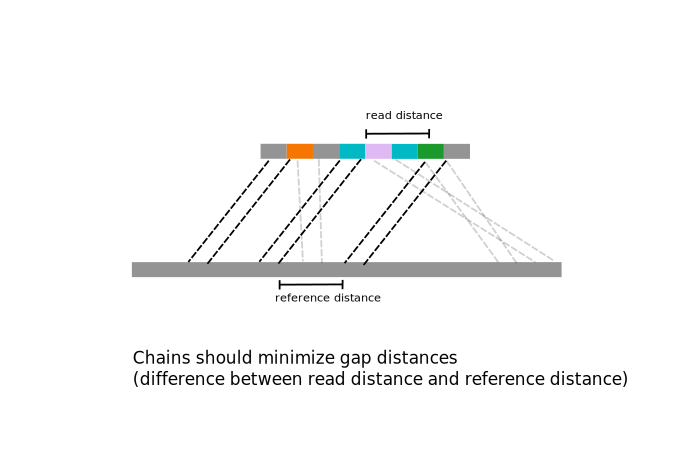

:::

::::

## Long read giraffe algorithm

:::: {style="display: grid; align-items: start; justify-items: start; grid-template-columns: 1fr 3fr; grid-column-gap: 10px;"}

::: {}

1. Seeding 
1. **Chaining**
1. Alignment


:::

::: {}

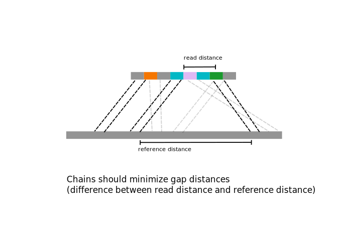

:::

::::
## Long read giraffe algorithm

:::: {style="display: grid; align-items: start; justify-items: start; grid-template-columns: 1fr 3fr; grid-column-gap: 10px;"}

::: {}

1. Seeding 
1. **Chaining**
1. Alignment


:::

::: {}


:::

::::

## Long read giraffe algorithm

:::: {style="display: grid; align-items: start; justify-items: start; grid-template-columns: 1fr 3fr; grid-column-gap: 10px;"}

::: {}

1. Seeding 
1. **Chaining**
1. Alignment


:::

::: {}

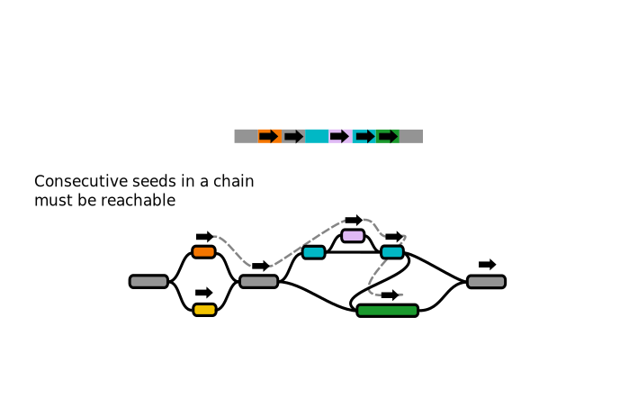

:::

::::

## Long read giraffe algorithm

:::: {style="display: grid; align-items: start; justify-items: start; grid-template-columns: 1fr 3fr; grid-column-gap: 10px;"}

::: {}

1. Seeding 
1. **Chaining**
1. Alignment


:::

::: {}

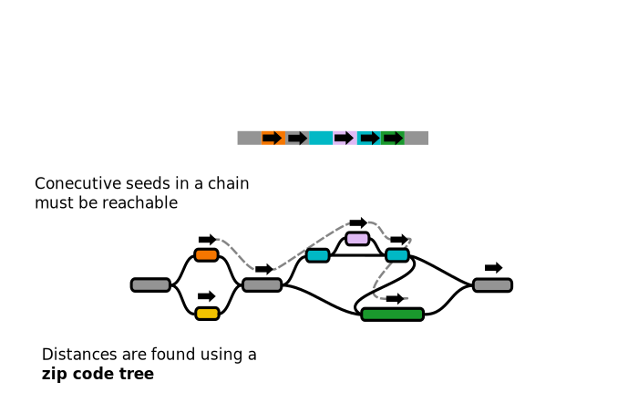

:::

::::


# Long read giraffe algorithm

:::: {style="display: grid; align-items: start; justify-items: start; grid-template-columns: 1fr 3fr; grid-column-gap: 10px;"}

::: {}

1. Seeding 
1. **Zip code tree making** with **Distance Index**
1. Chaining with **Zip code trees**
1. Alignment

:::

::: {}


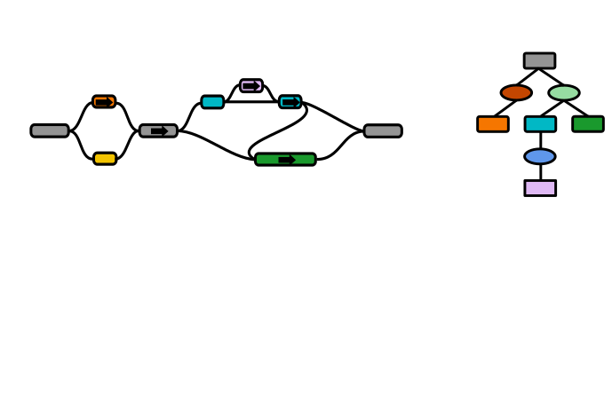

:::

::::


## Long read giraffe algorithm

:::: {style="display: grid; align-items: start; justify-items: start; grid-template-columns: 1fr 3fr; grid-column-gap: 10px;"}

::: {}

1. Seeding 
1. **Zip code tree making** with **Distance Index**
1. Chaining with **Zip code trees**
1. Alignment


:::

::: {}


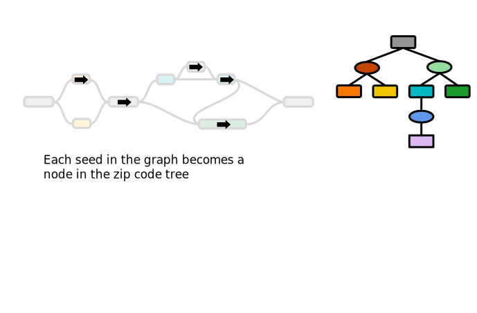

:::

::::

## Long read giraffe algorithm

:::: {style="display: grid; align-items: start; justify-items: start; grid-template-columns: 1fr 3fr; grid-column-gap: 10px;"}

::: {}

1. Seeding 
1. **Zip code tree making** with **Distance Index**
1. Chaining with **Zip code trees**
1. Alignment


:::

::: {}


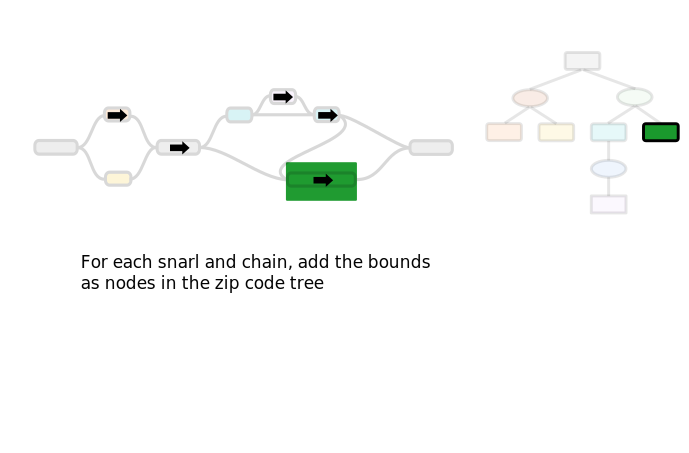

:::

::::


## Long read giraffe algorithm

:::: {style="display: grid; align-items: start; justify-items: start; grid-template-columns: 1fr 3fr; grid-column-gap: 10px;"}

::: {}

1. Seeding 
1. **Zip code tree making** with **Distance Index**
1. Chaining with **Zip code trees**
1. Alignment


:::

::: {}


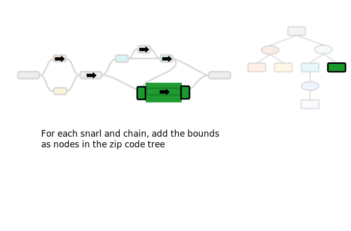

:::

::::


## Long read giraffe algorithm

:::: {style="display: grid; align-items: start; justify-items: start; grid-template-columns: 1fr 3fr; grid-column-gap: 10px;"}

::: {}

1. Seeding 
1. **Zip code tree making** with **Distance Index**
1. Chaining with **Zip code trees**
1. Alignment


:::

::: {}


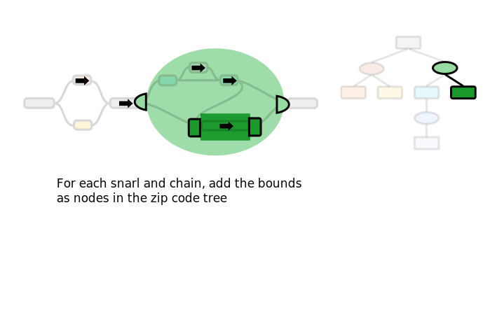

:::

::::


## Long read giraffe algorithm

:::: {style="display: grid; align-items: start; justify-items: start; grid-template-columns: 1fr 3fr; grid-column-gap: 10px;"}

::: {}

1. Seeding 
1. **Zip code tree making** with **Distance Index**
1. Chaining with **Zip code trees**
1. Alignment


:::

::: {}


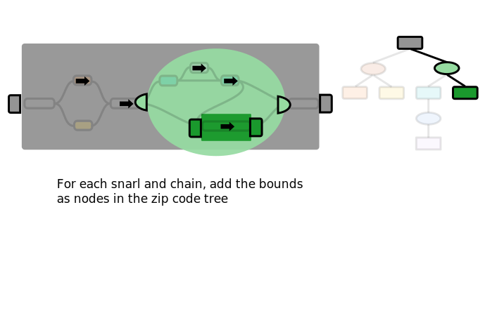

:::

::::


## Long read giraffe algorithm

:::: {style="display: grid; align-items: start; justify-items: start; grid-template-columns: 1fr 3fr; grid-column-gap: 10px;"}

::: {}

1. Seeding 
1. **Zip code tree making** with **Distance Index**
1. Chaining with **Zip code trees**
1. Alignment


:::

::: {}


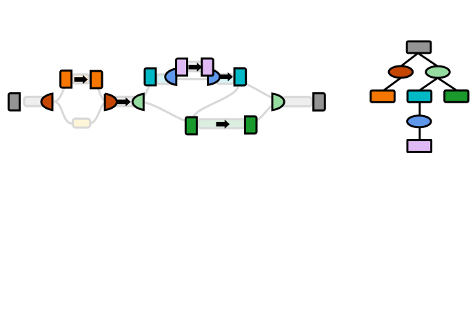

:::

::::


## Long read giraffe algorithm

:::: {style="display: grid; align-items: start; justify-items: start; grid-template-columns: 1fr 3fr; grid-column-gap: 10px;"}

::: {}

1. Seeding 
1. **Zip code tree making** with **Distance Index**
1. Chaining with **Zip code trees**
1. Alignment


:::

::: {}


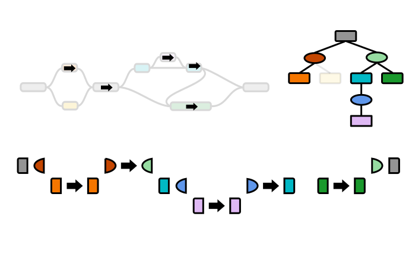

:::

::::


## Long read giraffe algorithm

:::: {style="display: grid; align-items: start; justify-items: start; grid-template-columns: 1fr 3fr; grid-column-gap: 10px;"}

::: {}

1. Seeding 
1. **Zip code tree making** with **Distance Index**
1. Chaining with **Zip code trees**
1. Alignment


:::

::: {}


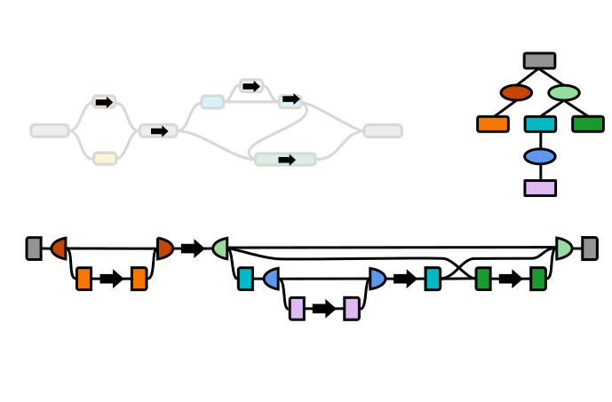

:::

::::


## Long read giraffe algorithm

:::: {style="display: grid; align-items: start; justify-items: start; grid-template-columns: 1fr 3fr; grid-column-gap: 10px;"}

::: {}

1. Seeding 
1. **Zip code tree making** with **Distance Index**
1. Chaining with **Zip code trees**
1. Alignment


:::

::: {}


:::

::::


## Long read giraffe algorithm

:::: {style="display: grid; align-items: start; justify-items: start; grid-template-columns: 1fr 3fr; grid-column-gap: 10px;"}

::: {}

1. Seeding 
1. Zip code tree making
1. Chaining
1. **Alignment** with graph

:::

::: {}


:::

::::

## Long read giraffe algorithm

:::: {style="display: grid; align-items: start; justify-items: start; grid-template-columns: 1fr 3fr; grid-column-gap: 10px;"}

::: {}

1. Seeding 
1. Zip code tree making
1. Chaining
1. **Alignment** with graph

:::

::: {}


:::

::::

## Long read giraffe algorithm

:::: {style="display: grid; align-items: start; justify-items: start; grid-template-columns: 1fr 3fr; grid-column-gap: 10px;"}

::: {}

1. Seeding 
1. Zip code tree making
1. Chaining
1. Alignment

:::

::: {}


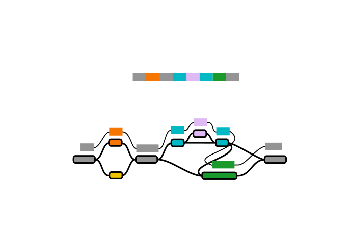

:::

::::


# Giraffe results

On the HPRC v2 graph which is x size?

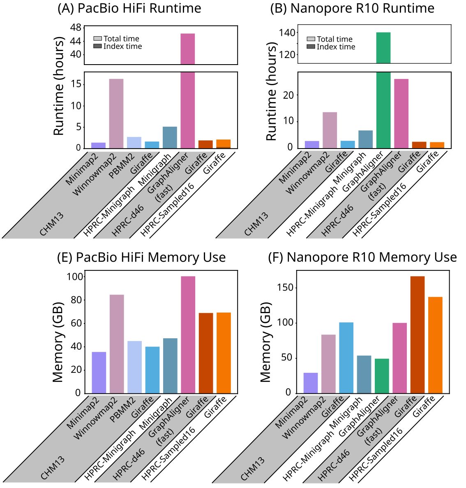{.half_wide_img}

# `vg` graph formats and indexes

**Indexes** 

::: incremental

1. `.gbwt` (Graph Burrows Wheeler Transform): haplotype paths
1. `.gg` (GBWT Graph): node sequences for a GBWT
1. `.dist` (Distance Index): snarl decomposition plus minimum distances
1. `.zipcodes`: per-node distance information used by `vg giraffe`
1. `.min` (Minimizer Index): minimizers used by `vg giraffe`
1. `.gcsa` (Generalized Compressed Suffix Array): substring index used by `vg map` and `vg mpmap`

:::

**Graphs** 

::: incremental

1. `.gbz` (GBWT + GG): the graph induced by the GBWT
1. `.hg` (/`.vg`) (HashGraph): graph format optimized for speed
1. `.pg` (/`.vg`) (PackedGraph): graph format optimized for space efficiency
1. `.xg`: older graph format
1. `.vg`: protobuf-based graph format 

:::

# Conclusion

# Useful resources

- vg wiki 
  - file types: https://github.com/vgteam/vg/wiki/File-Types
  -  snarl explainer: https://github.com/vgteam/vg/wiki/Snarls-and-chains
  - deconstruct: https://github.com/vgteam/vg/wiki/VCF-export-with-vg-deconstruct

- vg manpage: https://github.com/vgteam/vg/wiki/vg-manpage

- snarls paper doi: 10.1089/cmb.2017.0251

- short read giraffe paper doi: 10.1126/science.abg8871

- long read giraffe paper doi: 10.1101/2025.09.29.678807 


