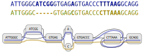

# Pangenome graph from assemblies

Built by aligning high-quality genomes, saved as paths through the pangenome.

{.half_wide_img .shadow_img}

Human Pangenome Reference Consortium (HPRC)

Liao, Asri, Ebler, et al. Nature 2023

# Pangenome

## With haplotype paths

# Snarls

*Definition of snarls*

# Mapping

`vg` follows the following steps:

::: incremental

1. Step 1
1. Step 2
1. Step 3

:::

## Step 1

## Step 2

## Step 3

# Indexes 

# Distance index 

## Distance index I

## Distance index II

## Distance index III

# Conclusion

